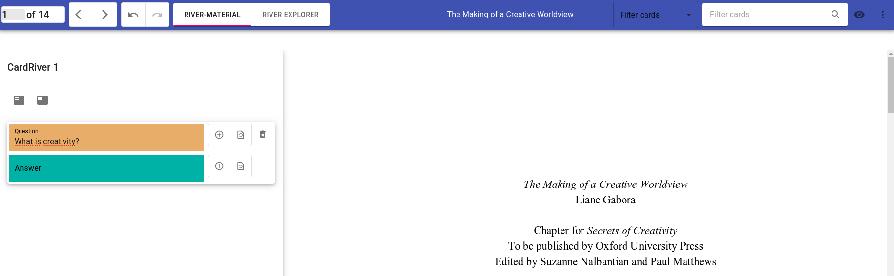
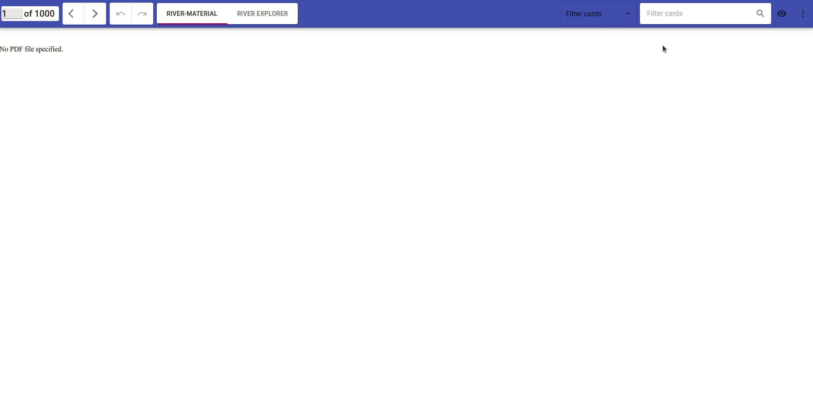
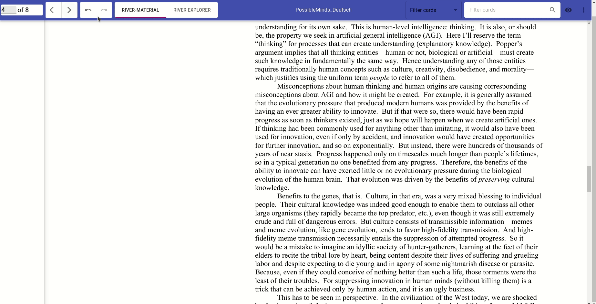
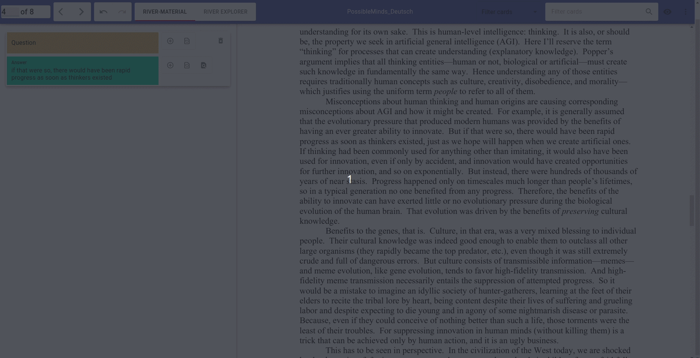
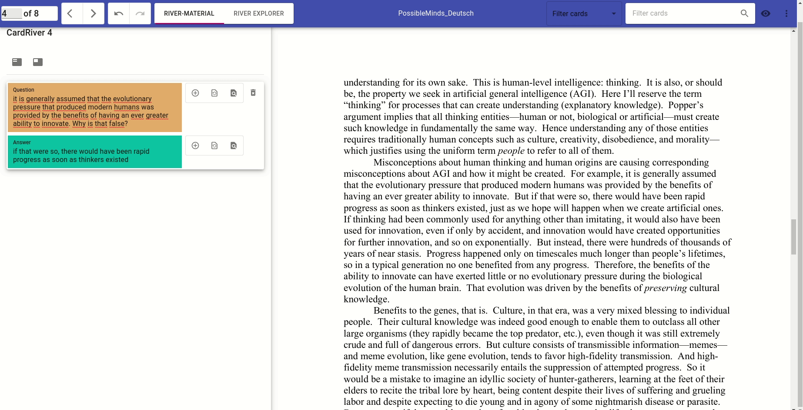
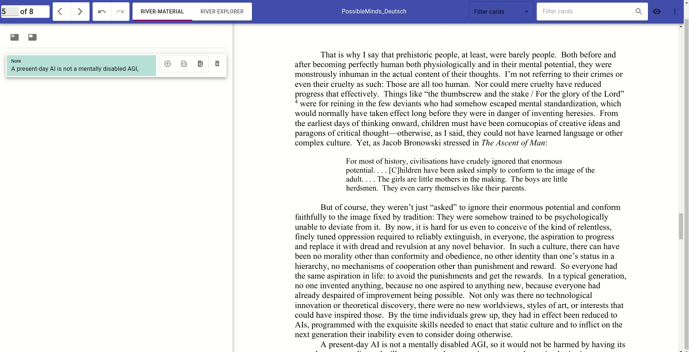
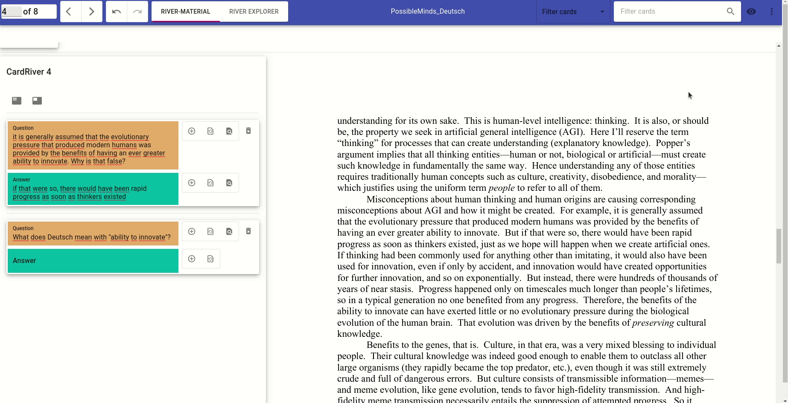
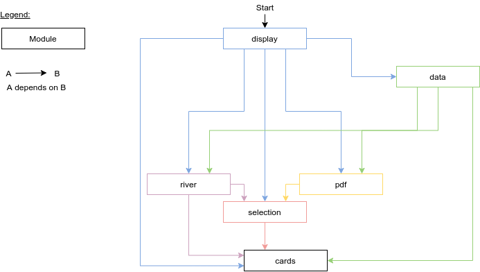

# ClayMemory - sculpt your mind

React-based reader and editor for creating notes and flash cards directly from PDF documents.

The main difference between ClayMemory and comparable softwares is that ClayMemory takes into account that the revision and the exact context of cards is important for a holistic learning approach and that if we integrate reader and editor we can automate a lot of steps. For more conceptual background see Overview. 

STATUS: prototype for HCI research into flash card creation (no repetition-backend at the moment).

Try it here: [https://luccahellriegel.github.io/ClayMemory](https://luccahellriegel.github.io/ClayMemory)

Only tested on Firefox and Chrome/Chromium (Desktop).

## GIFs to illustrate the most important features

### Load document

### Create card from context-menu

### Modify card-field via button

### Mark card-field for modification

### Create card from other card

### Jump to origin of card-field

### Download cards

## Controls

ClayMemory tries to explore a better alternative to using multiple programs and copy-pasting via clipboard, so the controls might take some getting used to. Most of the functionality is hinted at via tooltips and it does not hurt to play around. Be sure to drop any bugs you notice (+ screenshots, video or detailed description) in the issues.

### Mouse controls

- Selecting in the PDF or in the card-fields (and letting the left mouse-button go) captures the selected text (and additional context like the origin)
- Right-click allows fast creation of new cards from the selection
- Using the Add / Replace buttons on card-fields leads to the selection being added / replacing the respective card-fields
  - the origin of the selection overwrites the existing one

## Overview

Flash cards enable two of the most powerful empirically validated studying techniques: active recall and spaced repetition. Software like [Anki](https://apps.ankiweb.net/) brilliantly allows its users to study their flash cards everywhere and use algorithms to optimize the repetition intervals for maximum retention.

Creating digital flash cards, however, can be hard work, especially if huge amounts of material need to be covered. Hours are spent just copy-pasting or taking screenshots from lecture slides or book PDFs.

One way how this could be simplified dramatically would be if your document-reader included tools to quickly extract information from the documents in a flashcard-ready format, and to allow you to iterate upon your formulations in the context of where you extracted it from in the documents.

ClayMemory is a prototype of this new type of document-reader.

It is open source and primarily build to research the question of how an integration of flash-card tools with a reader can enhance the usability of creating flash cards and therefore enable an intuitive integration of memory enhancement in the studying or reading process. 
Future development might include a desktop app and a backend-connection to Anki, so that the flash cards can be comfortably created in ClayMemory and also use the comfort of Anki-based repetition.

Issues, PRs and general suggestions welcome.

## Features

- easy flash card creation / modification via automatic capture of text selection
  - working with selection: extraction-context menu for documents and cards for fast and easy flash card creation
  - working with selection: add / replace buttons for easy modification of existing cards
  - cross-card copying / replacing!
- multiple views:
  - River+Material: view the document/material and all the corresponding flash cards/CardRiver in parallel
  - River Explorer: view all your flash cards sorted by River/Page
  - Card Explorer: view all your flash cards
- origin-system: jump to the place in the document where you got the material for your flash card from
  - origin gets preserved when copying between cards
- customize the layout to always have access to the correct information
  - hide/show cards or document
  - filter your cards by type
  - search your cards
- handle multiple documents and their corresponding cards
- download or upload the document data sets
- basic PDF navigation
  - jump to page
  - highlight a search term
  - scroll trough the document
- undo/redo for all card-related operations
- local persistence in your browser, no cloud or additional download necessary
  - known issue: PDFs are not saved

## Tech Stack

- TypeScript
- React
  - Material-UI
  - react-pdf / PDF.js
- Redux
  - redux-toolkit
  - redux-persist
  - redux-undo
  - redux-thunk
  - reselect
- Testing
  - Jest for Unit Tests
  - Cypress for End-To-End Testing (outdated)
- [Architecture inspiration](https://jaysoo.ca/2016/02/28/organizing-redux-application/)
  - Boundary enforcement/testing via [dependency-cruiser](https://github.com/sverweij/dependency-cruiser)

## Architecture

Besides the classical React-Redux architecture, the modules are based around [redux-toolkit slices](https://redux-toolkit.js.org/tutorials/basic-tutorial#introducing-createslice) and are arranged according to this structure:

- "cards" contains the fundamental data model and basic components
- "selection" contains all components and services for capturing and displaying the users text-selection, as well as transforming it into a card
- "river" contains all components for displaying the cards
- "pdf" contains all components for displaying the pdf
- "data" mainly is the in-memory database of inactive pdf documents. It is connected to most components, because it needs to be able to load and save all document/card-data
- "display" combines all the modules to a working application

## License

My custom code is licensed under Apache 2.0 (see LICENSE file).

The favicon builds upon the Twemojii project and is copyright of Twitter, Inc and other contributors, and licensed under CC-BY 4.0.

## Available Scripts

This project was bootstrapped with [Create React App](https://github.com/facebook/create-react-app).

In the project directory, you can run:

### `npm start`

Runs the app in the development mode. 
Open [http://localhost:3000](http://localhost:3000) to view it in the browser.

The page will reload if you make edits. 
You will also see any lint errors in the console.

### `npm test`

Launches the test runner in the interactive watch mode. 
See the section about [running tests](https://facebook.github.io/create-react-app/docs/running-tests) for more information.

### `npm run build`

Builds the app for production to the `build` folder. 
It correctly bundles React in production mode and optimizes the build for the best performance.

The build is minified and the filenames include the hashes. 
Your app is ready to be deployed!

See the section about [deployment](https://facebook.github.io/create-react-app/docs/deployment) for more information.
